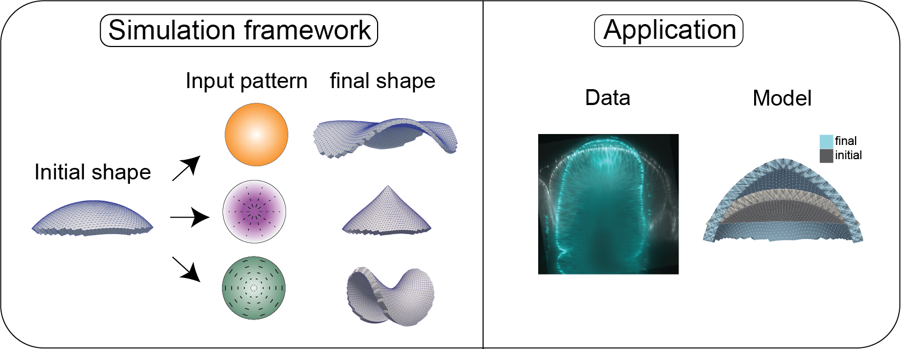

<h1 align="center">Wing Disc Eversion - Theory and Analysis</h1>

  
  

---

 Analyse and simulate morphogenesis of the larval wing in Drosophila
      

## About 
We analyze the growth patterns in the *Drosophila* wing disc during its transformation from a larva to a pupa. Growth patterns are obtained from processing segmented data from microscopic images. Using a spring lattice, we then verify whether these growth patterns can explain the 3D shape change in the wing disc.

## Folders
- Gallery - Representative simulation results and some presentations
- Experiments - data obtained from segmented images of wing disc (Jana Fuhrmann) and their analysis
- Simulations - scripts to run simulations, raw data of simulations, and their analysis
- Publication - Plots and description for publication

## Getting Started 

Clone the repository to get a copy of the project up and running on your local machine.
`git clone git@git.mpi-cbg.de:krishna/wdeversion_theory.git`

## Prerequisites
You need to install [OpenFPM](http://openfpm.mpi-cbg.de/) to run the simulations.
Other packages used are mentioned in the [requirements.txt](requirements.txt) file. You can create a [virtual environment](https://packaging.python.org/en/latest/guides/installing-using-pip-and-virtual-environments/#creating-a-virtual-environment) or just make sure that the packages on your machine are compatible with the packages mentioned in [requirements.txt](requirements.txt).

##  Authors 
- Abhijeet Krishna - [krishna@mpi-cbg.de](krishna@mpi-cbg.de)

## Project Members

- Dr. Jana Fuhrmann

- Dr. Joris Paijmans
- Dr. Charlie Duclut
- Dr. Marko Popovic
- Prof. Suzanne Eaton
- Prof. Frank Julicher
- Dr. Natalie Dye
- Dr. Carl Modes
- Abhijeet Krishna

## Acknowledgements 
- Abhinav Singh, Dr. Pietro Incardona, Prof. Ivo Sbalzarini and other members of the [OpenFPM](http://openfpm.mpi-cbg.de/) team (@MPI-CBG, Dresden)
- IT Department (@MPI-CBG, Dresden)
- Scientific Computation Department (@MPI-CBG, Dresden)
- Developers of packages mentioned in [requirements.txt](Environment/requirements.txt)
